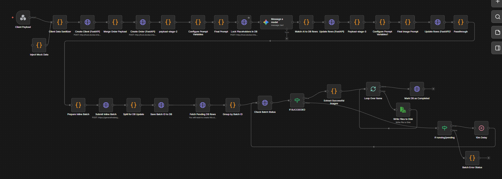

# Automated External Data Routing & Sanitization Pipeline

**Systems Integration & API Architecture Showcase:** This repository demonstrates advanced expertise in enterprise system orchestration. It highlights the ability to capture, aggressively sanitize, and route unstructured external webhook payloads into a strictly typed relational database using n8n and FastAPI.

> **🔒 Note on Confidentiality:** This repository serves as a technical architectural portfolio. To protect proprietary client data and secure backend infrastructure, this is a *partial upload*. The custom JavaScript sanitization nodes and specific API keys have been omitted. The provided code focuses on the core FastAPI architecture, Pydantic data validation schemas, and the overarching n8n workflow logic.

---

## 🗺️ Pipeline Architecture

## ⚙️ Target Tech Stack
* **Backend Framework:** FastAPI (Python 3.x)
* **Data Validation:** Pydantic
* **Database ORM:** SQLAlchemy
* **Orchestration & Integration:** n8n (Node-based workflow automation)
* **Real-Time Communication:** WebSockets

---

## 🏗️ Core System Architecture & Data Flow

This system was engineered to solve the bottleneck of manual data entry and schema errors caused by fragmented, unstructured payloads arriving from multiple external web sources. 

1. **Webhook Capture & Orchestration (n8n):** The system utilizes n8n to establish a zero-touch pipeline. Incoming payloads from external forms and APIs are captured via webhooks. The workflow initiates a multi-stage process that actively batches requests and routes them to the internal API.
   
2. **Aggressive Data Sanitization & Validation (FastAPI + Pydantic):** Before any external data touches the database, it is routed through FastAPI. I implemented strict Pydantic models (`schemas.py`) to enforce data types, handle missing variables, and standardize the payload. This ensures 100% database schema compliance for all incoming data.

3. **Fault Tolerance & Polling Loops:** To ensure system stability during high-volume transfers and external API interactions, the orchestration layer includes robust polling logic. This features deliberate delay nodes (e.g., 10-minute retry loops) to monitor asynchronous batch job statuses, automatically capturing successful data and preventing silent failures.

4. **Real-Time Master Dashboard Sync:** Once data is validated and committed via SQLAlchemy, the FastAPI backend pushes real-time state updates through WebSockets to a master-detail frontend dashboard, ensuring immediate organizational visibility of clean data.

---

## 📂 Key Files to Review

For technical auditing, please review the following core structural files:

* `schemas.py` - Demonstrates strict data validation and type-checking using Pydantic, proving the system's resilience against malformed external data.
* `main.py`  - Showcases the asynchronous FastAPI endpoints designed to receive and process the n8n payloads efficiently.

---

## 🚀 System Impact & Results

* **Eliminated Manual Bottlenecks:** Achieved a fully automated, zero-touch ingestion pipeline, reducing manual data entry time by 100%.
* **Guaranteed Data Integrity:** Enforced 100% schema compliance for all incoming external data, completely eliminating database errors caused by unstructured payloads.
* **High Fault Tolerance:** Successfully bridged the gap between raw web intake and production-ready database assets without manual intervention, even during external API downtime or high latency.
